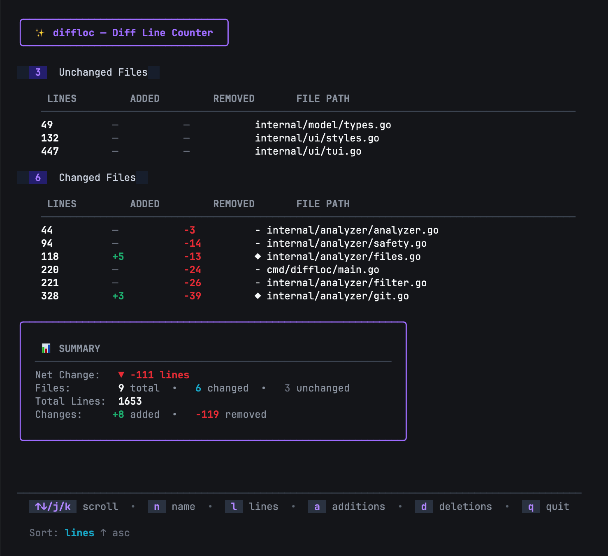

# diffloc
Git diff & line count statistics with a clean TUI. Shows line counts, additions, and deletions for your codebase. Works in non-git repos too.

<p align="center">
  
</p>


## Features
- Works in git repos and non-git directories
- Respects .gitignore (optional)
- Smart filtering for common artifacts
- Interactive sorting
- JSON and static output modes
- Configurable via file or flags
- Supports Golang, JavaScript, and Python projects (extensible via [.diffloc.yaml](#config-file))

## Installation
```bash
# Homebrew
brew tap nodelike/tap
brew install diffloc

# Go
go install github.com/nodelike/diffloc/cmd/diffloc@latest
```

## Usage

```bash
diffloc                    # Current directory
diffloc /path/to/project   # Specific path
diffloc --json             # JSON output
diffloc --static           # Non-interactive output
```

### Keyboard Controls

**Scrolling:**
- `↑` / `k` - Scroll up
- `↓` / `j` - Scroll down
- `PgUp` - Page up
- `PgDn` - Page down
- `Home` / `g` - Jump to top
- `End` / `G` - Jump to bottom

**Sorting:**
- `n` - Sort by name
- `l` - Sort by lines  
- `a` - Sort by additions
- `d` - Sort by deletions

**Other:**
- `q` - Quit

### Flags

| Flag | Description |
|------|-------------|
| `--no-gitignore` | Ignore .gitignore patterns |
| `--exclude-tests` | Exclude test files |
| `--exclude <pattern>` | Custom exclusion regex (repeatable) |
| `--ext <ext>` | Override allowed extensions (repeatable) |
| `--max-depth <n>` | Limit directory depth (0 = unlimited) |
| `--json` | Output as JSON |
| `--static` | Non-interactive output |
| `--config <file>` | Config file path (default: `.diffloc.yaml`) |

### Config File

Create `.diffloc.yaml` in your project root:

```yaml
exclude-tests: true
no-gitignore: false
max-depth: 0
exclude:
  - "vendor/"
  - "\\.pb\\.go$"
ext:
  - ".go"
  - ".py"
```

## What Gets Excluded

**Directories:** `node_modules`, `venv`, `.venv`, `__pycache__`, `.git`, `dist`, `build`, `.egg-info`, `.tox`, `coverage`, `.next`, `vendor`, `bin`, `tmp`

**Files:** Lock files (`*.lock`, `*-lock.json`), binaries (`*.exe`, `*.so`, `*.dylib`, `*.dll`), images (`*.jpg`, `*.png`, `*.svg`, etc.), generated files (`*_templ.go`, `*.pb.go`, `*.min.js`)

**Default Extensions:** `.go`, `.py`, `.js`, `.jsx`, `.ts`, `.tsx`, `.vue`, `.svelte`, `.mjs`, `.cjs`


## License

[MIT License](LICENSE)


made with ❤️ by [@nodelike](https://nodelike.com/)
